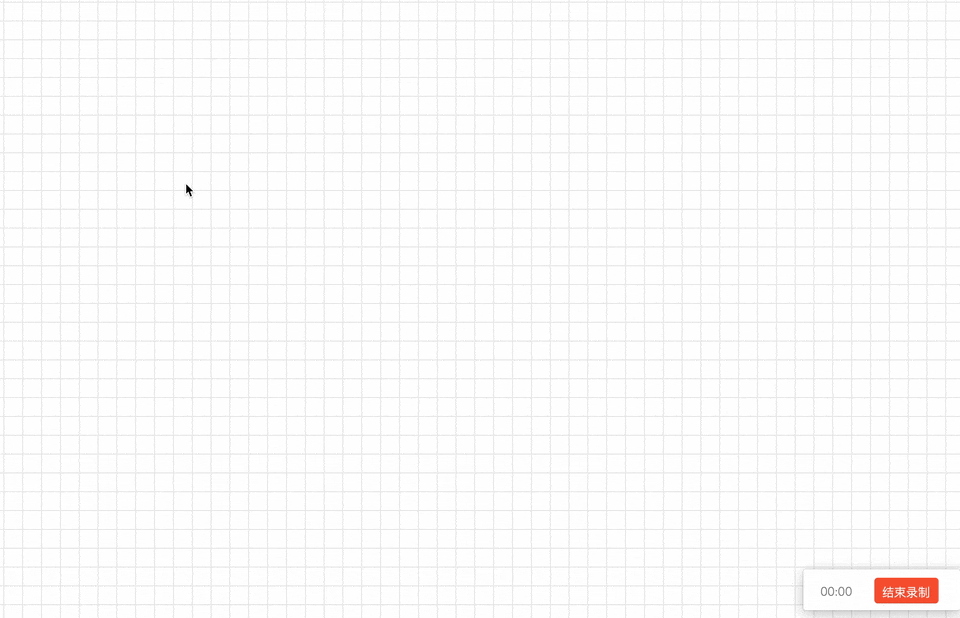
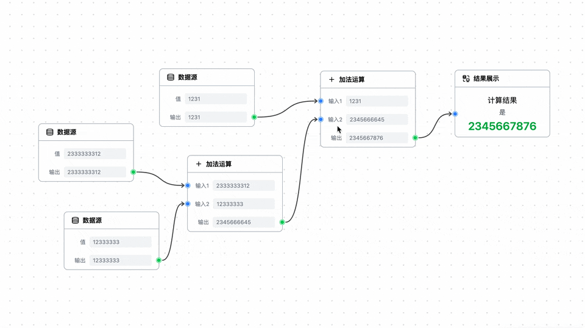
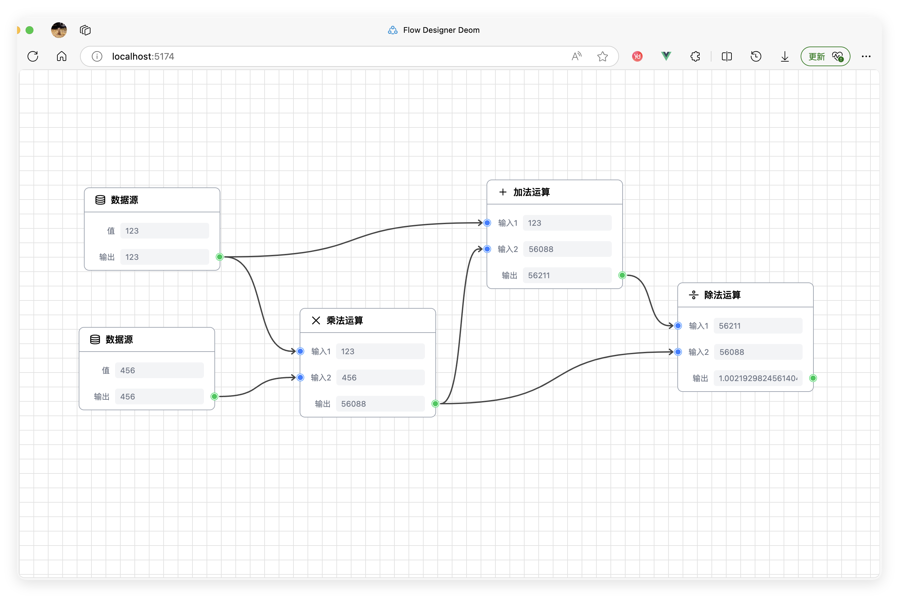

# Flow Designer 流程设计引擎

在线 DEMO：[项目网址](https://still-soda.github.io/flow-designer/)

## 效果预览

> 使用过程，包括创建、连接、移动、删除流程项



> 数据传递链**实时更新**



> 页面效果



## 关于 Flow Designer 

### 简介

Flow Designer 是一个使用 Vue (3.5) 和 TailwindCSS (4.0) 开发的，简洁但强大蓝图引擎，基于发布订阅模式构建，具有高可扩展性，注释完备。

### 特点

Flow Designer 具有非常简洁的设计，基于 EventEmitter 实现绝大多数事件的传递，因此可以通过监听和触发事件来干涉程序运行的各个流程。

### 目录结构

```bash
src
├── components/ # 存饭所有组件
├── events/     # 存放所有事件
├── utils/      # 存放大部分工具函数
├── extensions/ # 存放 DEMO 中展示的自定义组件
├── hooks/      # 存放所有钩子函数
└── types/      # 存放大部分类型
```

### 未来特性

- [ ] 删除连接线
- [ ] 反向更新、双向更新
- [ ] 添加获取流程图序列化结果的 Hook
- [ ] 自定义线条样式
- [ ] 自定义背景样式
- [ ] 根据序列化结果场景场景，本地持久化
- [ ] 自动布局

### 使用

1. 克隆该项目，复制以下文件夹到相同目录
   ```bash
   src
    ├── components/
    ├── events/
    ├── hooks/
    ├── utils/
    └── types/
   ```
2. 导入 FlowDesigner 组件
   ```ts
   import FlowDesigner from './components/FlowDesigner.vue';
   ```
3. 在模板中使用 FlowDesigner 组件
   ```html
   <!-- 可选通过 emitter 属性传入自定义事件触发器 -->
   <FlowDesigner :emitter="customEmitter" :options :flow-components />
   ```
4. 可以传入实现 Emitter 接口的自定义事件管理器来监听和修改蓝图设计器中所有的行为和变更。
   ```ts
   customEmitter.on<RegisterEndpoint>(REGISTER_ENDPOINT, (endpoint) => {
    // 在端点注册时打印记录
    console.log('端点已注册: ', endpoint)
   });
   ```

### 自定义流程项

参考 `src/extensions` 目录中的自定义流程组件，可以通过引入 `<BasicItem />` 和 `<Endpoint />` 实现自定义组件。

此处参考 `ResultItem` 组件：

```html
<template> 
   <!-- type 为自定义流程项的名字 -->
   <BasicItem type="result" :endpoint-props :id :position>
      <!-- 自定义流程项头部 -->
      <template #header>
         <DataDisplay />
         <h1 class="font-semibold text-sm">结果展示</h1>
      </template>
      <!-- 自定义流程项主内容 -->
      <template #default="{ data }">
         <div class="relative">
            <div class="flex flex-col items-center justify-center my-2 gap-1">
               <div class="text-md">计算结果</div>
               <div class="text-sm text-gray-600">是</div>
               <div class="text-2xl text-green-600 font-semibold font-sans">
                  {{ data.value || 0 }}
               </div>
            </div>
            <!-- 放置端点，会被自动固定到左右侧中点 -->
            <EndPoint v-bind="data" />
         </div>
      </template>
   </BasicItem>
</template>

<script setup lang="ts">
import type { EndpointProps } from '../types/endpoint.type';
import type { Point } from '../utils/point.util';
import { DataDisplay } from '@icon-park/vue-next';
import BasicItem from '../components/BasicItem/index.vue';
import EndPoint from '../components/BasicItem/EndPoint.vue';
// 类型定义参考 `src/types/endpoint.type.ts`，传入 BasicItem
const endpointProps: EndpointProps[] = [
   {
      position: 'left',
      label: '输入1',
      theme: 'primary',
      maxConnections: 1,
      type: 'input',
      value: '0',
   },
];
// 自定义组件会被容器传入 `id` 和 `position`，需要绑定在 BasicItem 中
defineProps<{ id: string; position: Point }>();
</script>
```

## 开源协议

本项目采用 MIT 开源协议，欢迎提交 PR 获 issue，如果你觉得对你有帮助，希望能给我一个小小的 Star🌟！